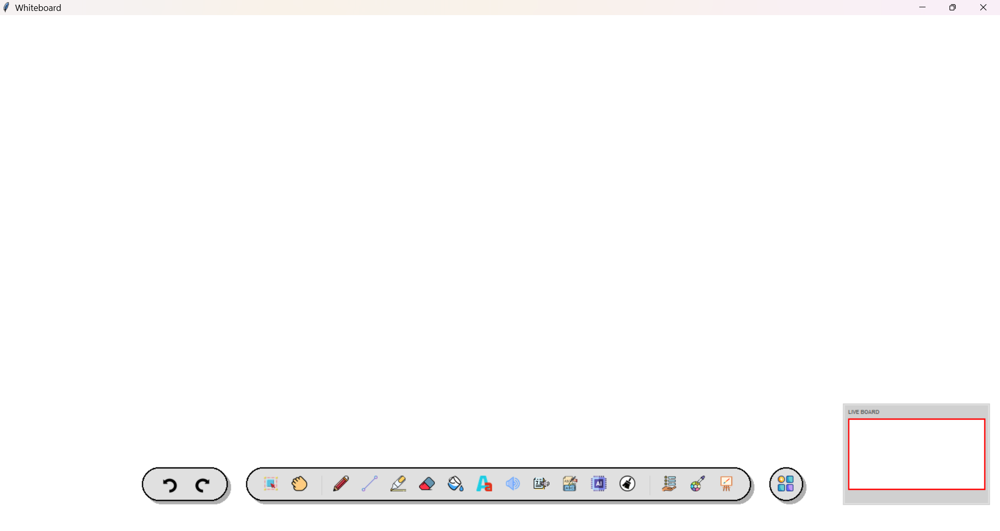
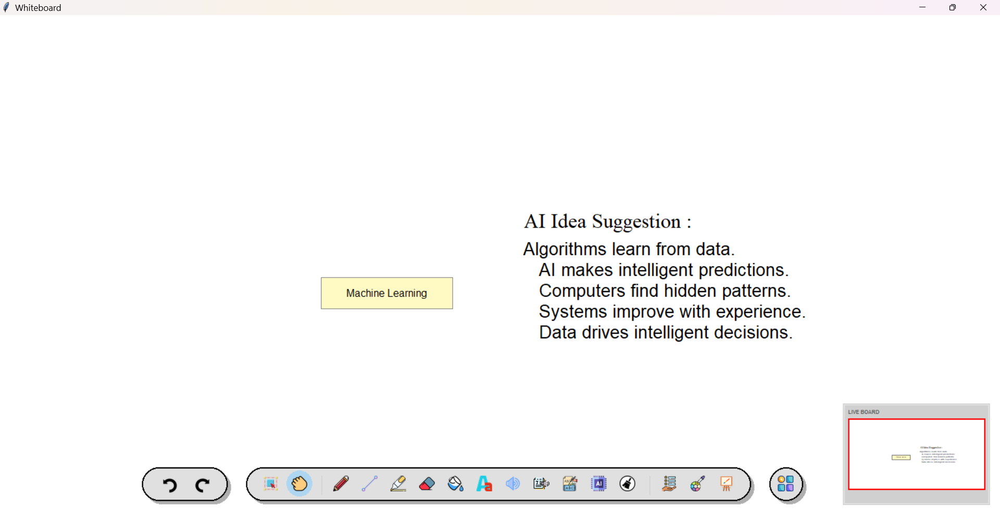
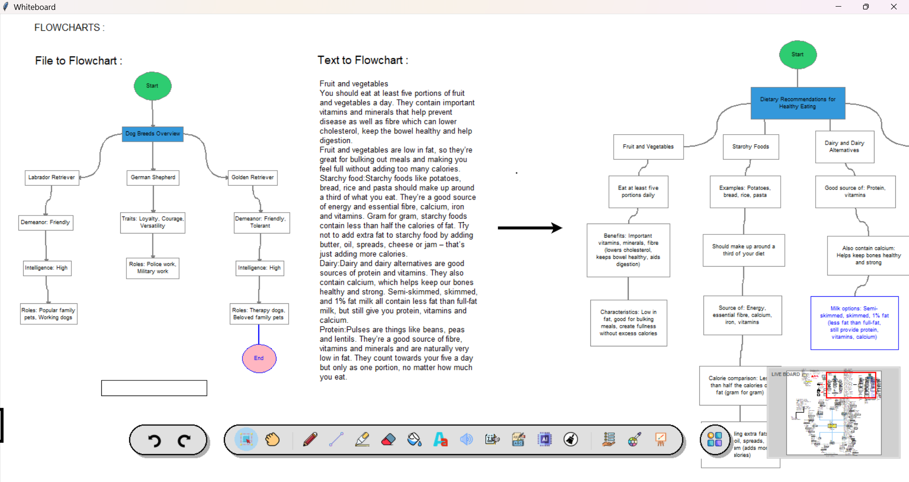

# 🎨 AI-enhanced WhiteBoard

[](https://www.python.org/downloads/)
[](LICENSE)
[](#-key-features)
[](#-visual-showcase)
[](#-key-features)

**AI-enhanced WhiteBoard** is a professional-grade productivity application that blends the simplicity of a classic whiteboard with the power of modern Generative AI. Whether you're brainstorming, teaching, or designing, these tools are built to amplify your creativity.

---

## 📷 Visual Showcase



| **Idea Generation** | **AI Magic Tools** | **Advanced Shapes** |
| :---: | :---: | :---: |
|  |  |  |

---

## 💡 Key Features

### 🤖 AI Capabilities

- **Magic Flowchart**: Convert natural language descriptions or YouTube video URLs directly into professional diagrams using Graphviz and LLM-powered parsing (`flowchart_utils.py`).
- **YouTube Summarization**: Paste any YouTube URL to extract, chunk, and recursively summarize long-form transcripts (up to 3+ hours) into structured visual notes (`youtube_utils.py`).
- **Intelligent Idea Generation**: Powered by **Google Gemini** and **Groq (Llama-3)** for high-speed brainstorming and content synthesis (`ai_tools_mixin.py`).
- **Text Extraction (OCR)**: Seamlessly pull text from images and PDF imports via a dedicated **Flask OCR microserver** backed by Tesseract (`flask_ocr_server.py`).
- **Voice Assistant**: Hands-free tool switching, dictation, and AI queries with **offline speech-to-text** via Faster-Whisper (configurable; falls back to Google online) (`voiceassistant.py`, `speech_stt.py`).

### 🎨 Drawing & Design

- **Vector Shapes**: Rectangles, Ovals, Triangles, Diamonds, and custom Polygons.
- **Smart Connectors**: Effortlessly link objects with auto-routing lines.
- **Auto-Shape Detection**: Hand-drawn sketches automatically convert into clean geometric shapes.
- **Layer Management**: Full control with Grouping, "Bring to Front", and "Send to Back" functionality.
- **Highlighter & Annotations**: Multi-color highlighter tool with adjustable opacity.

### ⚡ Professional UX

- **Presentation Mode**: Includes a virtual laser pointer for live demonstrations.
- **Mini-Map**: A persistent navigation window for large-scale projects.
- **Themed Interface**: Toggle between sleek **Dark Mode** and crisp **Light Mode**.
- **Infinite Undo/Redo**: Never worry about mistakes with a robust action stack.
- **Canvas Templates**: Load pre-built `.aiwb` templates to jumpstart your session.

---

## 🏗️ Architecture Overview

```
User
 └── Tkinter Frontend (whiteboard.py)
      ├── Interactive Canvas
      ├── UI Components (ui_components.py)
      └── Application Logic Layer
           ├── AI Tools Mixin (ai_tools_mixin.py)
           │    ├── Google Gemini API
           │    └── Groq API (Llama-3)
           ├── Flowchart Utils (flowchart_utils.py)
           │    └── Graphviz Engine
           ├── YouTube Utils (youtube_utils.py)
           │    └── YouTube API / yt-dlp
           ├── Voice Assistant (voiceassistant.py)
           ├── OCR Engine (flask_ocr_server.py)  ← Flask Microserver
           │    └── Tesseract OCR
           ├── SQLite Database
           └── JSON / .aiwb File Storage
```

---

## 🚀 Installation & Setup

### 1. Prerequisites

Ensure you have the following installed on your system:

- **Tesseract OCR**: [Required for Text Extraction] ([Download](https://github.com/tesseract-ocr/tesseract))
- **Graphviz**: [Required for Flowcharts] ([Download](https://graphviz.org/download/)) — *Add to system PATH during installation.*

### 2. Clone & Install

```bash
# Clone the repository
git clone https://github.com/sxohamm/AI-enhanced-WhiteBoard.git
cd AI-enhanced-WhiteBoard

# Install Python dependencies
pip install -r requirements.txt
```

### 3. API Configuration

Create a `.env` file in the root directory to enable AI features:

```env
GOOGLE_API_KEY=your_gemini_api_key
GROQ_API_KEY=your_groq_api_key

# Speech-to-text (voice assistant & Voice Notes dictation)
STT_ENGINE=faster-whisper
WHISPER_MODEL=base
WHISPER_LANGUAGE=en
WHISPER_DEVICE=cpu
WHISPER_COMPUTE_TYPE=int8
STT_PRELOAD=true
```

| Variable | Values | Description |
| :--- | :--- | :--- |
| `STT_ENGINE` | `faster-whisper`, `whisper`, `google` | Local Faster-Whisper is the default (offline). Use `google` for the legacy online API. |
| `WHISPER_MODEL` | `tiny`, `base`, `small`, … | Model size; `base` balances speed and accuracy on CPU. |
| `WHISPER_DEVICE` | `cpu`, `cuda`, `auto` | Inference device for local engines. |
| `WHISPER_COMPUTE_TYPE` | `int8`, `float16`, … | Faster-Whisper quantization (`int8` is fast on CPU). |
| `STT_PRELOAD` | `true` / `false` | Load the Whisper model at startup to avoid first-command delay. |

Optional: `pip install openai-whisper` if you set `STT_ENGINE=whisper`.

### 4. Run

```bash
# Start the OCR Flask microserver (in a separate terminal)
python flask_ocr_server.py

# Launch the main application
python whiteboard.py
```

---

## ⌨️ Keyboard Shortcuts

| Shortcut | Action | Shortcut | Action |
| :--- | :--- | :--- | :--- |
| `B` | Brush / Pen | `V` / `S` | Select / Move |
| `E` | Eraser | `T` | Add Text |
| `Space + Drag` | Pan View | `Ctrl + +/-` | Zoom In/Out |
| `Delete` | Delete Item | `Ctrl + G` | Group Selected |
| `Ctrl + Z/Y` | Undo / Redo | `Ctrl + S` | Save Project |
| `[` / `]` | Layer Back/Forward | `Alt` | Toggle Hotkey Hints |

---

## 🧰 Technical Stack

| Layer | Technology |
| :--- | :--- |
| **Frontend** | Python — Tkinter + Custom UI Components |
| **AI / LLM** | Google Gemini API, Groq API (Llama-3) |
| **Diagrams** | Graphviz, `flowchart_utils.py` (Flowchart Fun syntax parser) |
| **OCR** | Tesseract OCR via Flask microserver (`flask_ocr_server.py`) |
| **YouTube** | `yt-dlp`, YouTube Transcript API (`youtube_utils.py`) |
| **Voice** | Faster-Whisper (offline STT), pyttsx3 TTS (`speech_stt.py`, `voiceassistant.py`) |
| **Storage** | SQLite (session data), JSON / `.aiwb` (canvas state) |
| **Graphics** | Pillow (PIL), Graphviz |

---

## 🤝 Contributing

Contributions are welcome! Please feel free to submit a Pull Request.

---

*Crafted for productivity and creativity.*
